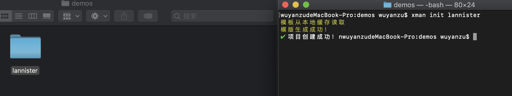
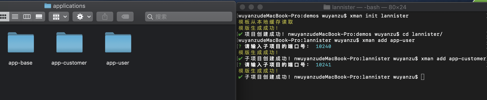
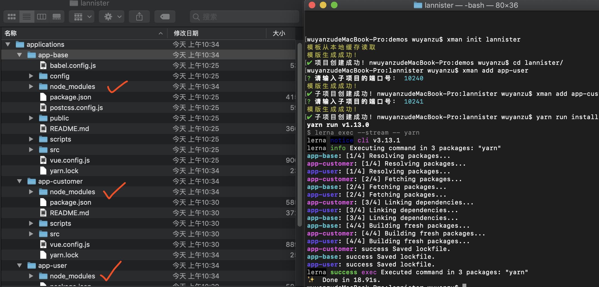

# xman-cli

设计参考来自于美团的`用微前端的方式搭建类单页应用`文章，基于`vue-cli`脚手架搭建的微前端应用。

为了解决如下问题：

1. 前端巨无霸，一个项目包含成百上千页面；
2. 打包越来越慢；
3. 公共模块、方法、版本、技术栈的统一；

借用后端微服务的概念，采用微前端的方法，提供一个`注册中心`，将每一个模块的内容拆分成独立的一个子系统，每个子系统在注册中心注册之后，就可以独立的开发，打包，发布，最终实现共用一个域名的单页面，根据一级路径去区分各个系统模块。

得益于单页面，各个页面资源按需加载，无刷新，用户体验效果好。

总结有如下优点：

1. 单点登录（sso）；
2. 全局子系统导航权限控制；
3. 全局异常处理；
4. 全局数据上报监控；

这样可以实现`前端高聚合，后端低耦合`的主旨思想。

## 基本使用方法

- init 新建一个主项目

```bash
xman init xxxx
```



- add 新建一个子项目

根据提示输入对应端口号

```bash
xman add xxxx
```



---

项目基于`lerna`进行统一的包管理

启动步骤：

1. 安装所需依赖

```base
yarn run install
```

会将所有项目的依赖项都安装好



2. 启动项目

```base
yarn run serve
```

### 实现原理

1. 指定子系统统一的入口文件，配置`webpack`加入到主项目编译的入口文件中；
2. 将各个子系统单独启动，通过反向代理的方法将请求转发到主项目；
3. 子项目的一级路径必须规定为子项目名称；
4. vuex借用`modules`来实现子项目注册和发布；
5. 打包阶段，将子项目打包成一个独立的库文件，实现参考`vue-cli构建目标`；
6. 发布阶段，通过持续集成的构建方式合并所有项目；
